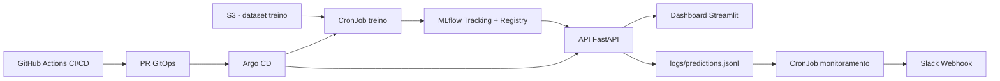

# Passos Magicos - Plataforma MLOps End-to-End

Pipeline completo de Machine Learning para predicao de **Ponto de Virada** dos alunos da Passos Magicos, cobrindo:

- treinamento automatizado com dados no S3
- registro e versionamento de modelos no MLflow
- serving via API FastAPI
- monitoramento de drift e distribuicao de predicoes
- alertas no Slack
- deploy GitOps com Argo CD
- CI/CD com GitHub Actions

## Objetivo do projeto

Entregar um fluxo de MLOps de ponta a ponta, com rastreabilidade e operacao em cluster Kubernetes:

1. Treinar modelo periodicamente.
2. Registrar versoes no MLflow.
3. Promover modelo para serving com controle de rollout.
4. Monitorar sinais de degradacao/drift.
5. Alertar rapidamente o time em caso de anomalia.

## Arquitetura (visao geral)



## Componentes principais

| Componente | Papel |
|---|---|
| `api/main.py` | API de predicao, metricas, endpoints de alerta e reload de modelo |
| `scripts/train_model.py` | Pipeline de treino (local/S3), registro no MLflow e promocao para Staging |
| `scripts/monitoring_job.py` | Job in-cluster para drift/performance + envio direto para Slack |
| `src/mlflow_tracking/*` | Tracking de experimentos e registry com estrategia por alias |
| `src/feature_store/*` | Feature Store offline (Parquet) + online (SQLite) |
| `k8s/deployment.yaml` | Deploy da API e dashboard |
| `k8s/cronjob-train.yaml` | CronJobs de treino e monitoramento |
| `.github/workflows/ci.yml` | Qualidade, testes e build de imagem |
| `.github/workflows/cd.yml` | Build/push multi-arch + PR GitOps de release |
| `.github/workflows/deploy-model.yml` | Promocao/rollback de modelo com PR GitOps para rollout |

## Estrutura do repositorio

```text
api/                    # FastAPI
src/                    # Codigo de ML, feature store, monitoramento, mlflow
scripts/                # Jobs e demos operacionais
k8s/                    # Manifests de deploy e cronjobs
argocd/                 # Application Argo CD + valores do MLflow e Postgres
.github/workflows/      # CI/CD e deploy de modelo
Dockerfile              # Imagem da API (tambem usada pelos jobs)
Dockerfile.dashboard    # Imagem do dashboard Streamlit
Makefile                # Atalhos de setup, treino, testes e execucao local
```

## Fluxos de negocio e operacao

### 1) Treinamento

1. CronJob `passos-magicos-train` baixa dataset do S3.
2. Preprocessa dados e faz feature engineering.
3. Treina modelo (`random_forest` por padrao).
4. Registra experimento e modelo no MLflow.
5. Promove versao mais recente para alias `staging`.
6. Materializa features no online store para inferencia.

Schedule atual (`k8s/cronjob-train.yaml`):
- treino: `0 6 * * 1` (semanal)
- monitoramento: `0 */6 * * *` (a cada 6h)

Observacao: o timezone do CronJob depende do timezone do cluster (normalmente UTC).

### 2) Serving

A API carrega modelo por estrategia de runtime:

- `MODEL_SOURCE=mlflow`: carrega do MLflow Registry (recomendado em producao)
- `MODEL_SOURCE=local`: carrega arquivo local em `models/`

Para MLflow, o stage configurado em `MLFLOW_MODEL_STAGE` e resolvido para alias (`@production` / `@staging`).

### 3) Monitoramento

O job `scripts/monitoring_job.py` executa dois checks:

1. **Prediction drift** com base em `logs/predictions.jsonl`.
2. **Distribuicao de classes** consultando `GET /metrics` da API.

Se houver anomalia, envia alerta direto para Slack via `SLACK_WEBHOOK_URL`.

### 4) Deploy e GitOps

- `cd.yml` gera imagens (`api` e `dashboard`), push no Docker Hub e abre PR atualizando manifests em `k8s/`.
- Argo CD sincroniza o cluster apos merge.
- `deploy-model.yml` promove/rollback no MLflow e abre PR GitOps para alterar annotation `mlops.passos-magicos/reload-at`, forcando rollout controlado da API.

## Setup local rapido

### Requisitos

- Python 3.11+
- Docker + Docker Compose
- Make

### Rodar local com Make

```bash
cp .env.example .env
make setup
make train
make api
```

Em outro terminal:

```bash
make dashboard
```

### Rodar stack local com Docker Compose

```bash
docker compose up --build
```

Servicos locais:

- API: `http://localhost:8000`
- Swagger: `http://localhost:8000/docs`
- Dashboard: `http://localhost:8501`
- MLflow: `http://localhost:5000`

## Comandos uteis de desenvolvimento

```bash
make test
make test-cov
make lint
make format
make docker-up
make docker-down
```

## Variaveis de ambiente importantes

Base: `.env.example`

| Variavel | Uso |
|---|---|
| `MLFLOW_TRACKING_URI` | Endpoint do MLflow |
| `MLFLOW_TRACKING_USERNAME` / `MLFLOW_TRACKING_PASSWORD` | Auth do MLflow (quando habilitado) |
| `MLFLOW_MODEL_NAME` | Nome do modelo no registry |
| `MLFLOW_MODEL_STAGE` | Stage logico (`Staging`/`Production`) |
| `MODEL_SOURCE` | `mlflow` ou `local` |
| `MODEL_FALLBACK_LOCAL` | fallback para arquivo local se MLflow falhar |
| `ADMIN_RELOAD_TOKEN` | token do endpoint `/admin/reload-model` |
| `SLACK_WEBHOOK_URL` | webhook do Slack para alertas |
| `DRIFT_THRESHOLD` | threshold de drift no detector |
| `PERFORMANCE_WINDOW` | janela de analise de predicoes |

## Endpoints principais da API

- `GET /health`
- `GET /model/info`
- `POST /predict`
- `POST /predict/batch`
- `GET /metrics`
- `GET /features/status`
- `GET /predict/aluno/{aluno_id}`
- `GET /predict/alunos?aluno_ids=1,2,3`
- `POST /admin/reload-model`
- `GET /alerts/status`
- `GET /alerts/history`
- `POST /alerts/test`
- `POST /alerts/send`

## CI/CD no GitHub Actions

### CI (`.github/workflows/ci.yml`)

- lint (`black`, `isort`, `flake8`, `mypy`)
- testes com cobertura minima de 90%
- scan de seguranca (`safety`, `bandit`)
- build de imagens para validar Dockerfiles

### CD (`.github/workflows/cd.yml`)

Trigger:

- push em tag `v*`
- execucao manual (`workflow_dispatch`)

Fluxo:

1. build e push das imagens API e Dashboard
2. PR GitOps com update de `k8s/deployment.yaml` e `k8s/cronjob-train.yaml`
3. release no GitHub (quando trigger por tag)

Plataformas padrao de build:
- `linux/amd64,linux/arm64`

### Deploy de modelo (`.github/workflows/deploy-model.yml`)

Fluxos manuais:

- `promote` para `Staging` ou `Production`
- `rollback` para versao especifica

Ao promover/rollback para producao, o workflow abre PR GitOps para rollout da API.

## Segredos e configuracoes necessarias

### 1) GitHub Actions (repo secrets/vars)

**Secrets obrigatorios para CD:**

- `DOCKERHUB_USERNAME`
- `DOCKERHUB_TOKEN`

**Secrets para deploy de modelo (MLflow):**

- `MLFLOW_TRACKING_URI`
- `MLFLOW_TRACKING_USERNAME`
- `MLFLOW_TRACKING_PASSWORD`

**Repo variable opcional:**

- `IMAGE_NAME` (default: `passos-magicos`)

**Importante nas configuracoes do repositorio:**

- `Settings > Actions > General > Workflow permissions`: habilitar `Read and write permissions`
- `Allow GitHub Actions to create and approve pull requests`: habilitar

### 2) Kubernetes (namespace `passos-magicos`)

O projeto referencia recursos que precisam existir no cluster.

#### ConfigMap base

Nome esperado: `passos-magicos-config`

Chaves recomendadas:

- `API_HOST`, `API_PORT`, `LOG_LEVEL`
- `MODEL_SOURCE`, `MODEL_FALLBACK_LOCAL`
- `MLFLOW_ENABLED`, `MLFLOW_TRACKING_URI`, `MLFLOW_MODEL_NAME`, `MLFLOW_MODEL_STAGE`
- `ADMIN_RELOAD_TOKEN` (opcional)

#### Secrets esperados

| Secret | Uso | Chaves |
|---|---|---|
| `mlops-data-creds` | acesso S3 no treino | `AWS_ACCESS_KEY_ID`, `AWS_SECRET_ACCESS_KEY`, `AWS_DEFAULT_REGION` |
| `mlflow-tracking-auth` | auth no MLflow | `MLFLOW_TRACKING_USERNAME`, `MLFLOW_TRACKING_PASSWORD` |
| `mlops-monitoring-alerts` | alerta Slack no job de monitoramento | `SLACK_WEBHOOK_URL` |

Notas:

- `mlflow-tracking-auth` e `mlops-monitoring-alerts` estao com `optional: true` nos manifests.
- sem `SLACK_WEBHOOK_URL`, o monitoramento continua, mas nao envia notificacao.

#### Volumes/PVCs esperados

- `models-pvc`
- `logs-pvc`
- `feature-store-pvc`

## Deploy no cluster

### Aplicar manifests da aplicacao

```bash
kubectl apply -f k8s/deployment.yaml
kubectl apply -f k8s/cronjob-train.yaml
```

### Argo CD

Application principal:

- `argocd/application.yaml` (path `k8s`, sync automatica com `prune` e `selfHeal`)

Arquivos auxiliares para stack MLflow:

- `argocd/pg-mlflow.yml` (Postgres CNPG)
- `argocd/mlflow-helm-values.yml` (valores do chart MLflow)

## Runbook operacional

### Disparar treino manual

```bash
kubectl -n passos-magicos create job --from=cronjob/passos-magicos-train train-manual-$(date +%s)
kubectl -n passos-magicos logs -f job/<job-name>
```

### Disparar monitoramento manual

```bash
kubectl -n passos-magicos create job --from=cronjob/passos-magicos-monitoring monit-manual-$(date +%s)
kubectl -n passos-magicos logs -f job/<job-name>
```

### Verificar metricas da API no cluster

```bash
kubectl -n passos-magicos port-forward svc/passos-magicos-api 8000:8000
curl -s http://localhost:8000/health
curl -s http://localhost:8000/metrics
```

### Promover modelo para producao via workflow

```bash
gh workflow run deploy-model.yml \
  -f action=promote \
  -f model_name=passos-magicos-ponto-virada \
  -f target_stage=Production
```

### Rollback de modelo via workflow

```bash
gh workflow run deploy-model.yml \
  -f action=rollback \
  -f model_name=passos-magicos-ponto-virada \
  -f version=<VERSAO>
```

## Troubleshooting rapido

### `ModuleNotFoundError: No module named 'src'` no job de monitoramento

Status atual do projeto: corrigido com execucao modular e ajuste de `sys.path`.

- CronJob usa: `python -m scripts.monitoring_job`
- script injeta raiz do projeto no path

### `[alert] SLACK_WEBHOOK_URL not configured`

Significa que o secret `mlops-monitoring-alerts` nao tem a chave `SLACK_WEBHOOK_URL` ou nao foi associado ao pod.

### Workflow falha ao criar PR GitOps

Verifique as permissoes do repositorio:

- `Read and write permissions`
- `Allow GitHub Actions to create and approve pull requests`

## Boas praticas de versionamento

Artefatos operacionais nao devem ser versionados. O `.gitignore` ja protege:

- `models/*` (mantendo `models/.gitkeep`)
- `mlruns/`
- `feature_store/offline/`
- `feature_store/online/`
- `logs/*.jsonl`

## Licenca

Este projeto esta sob a licenca MIT. Consulte `LICENSE`.
