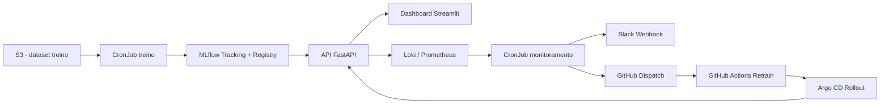

# Passos Mágicos - Plataforma MLOps End-to-End

Pipeline completo de Machine Learning para predição de **Ponto de Virada** dos alunos da Passos Mágicos, cobrindo:

- treinamento automatizado com dados no S3
- registro e versionamento de modelos no MLflow
- serving via API FastAPI
- monitoramento de drift e distribuição de predições
- alertas no Slack e gatilhos automáticos de retreino
- deploy GitOps com Argo CD
- observabilidade moderna com OpenTelemetry + Loki + Prometheus

## Objetivo do projeto

Entregar um fluxo de MLOps de ponta a ponta, com rastreabilidade e operação em cluster Kubernetes:

1. Treinar modelo periodicamente.
2. Registrar versões no MLflow.
3. Promover modelo para serving com controle de rollout via GitOps.
4. Monitorar sinais de degradação/drift com a lib Evidently.
5. Autocura: disparar retreino automático ao detectar anomalias.

## Arquitetura (visão geral)


```mermaid
graph LR
    A[S3 - dataset treino] --> B[CronJob treino]
    B --> C[MLflow Tracking + Registry]
    C --> D[API FastAPI]
    D --> E[Dashboard Streamlit]
    D --> F[Loki / Prometheus]
    F --> G[CronJob monitoramento]
    G --> H[Slack Webhook]
    G --> I[GitHub Dispatch]

    I --> J[GitHub Actions Retrain]
    J --> K[Argo CD Rollout]
    K --> D
```

## Componentes principais

| Componente | Papel |
|---|---|
| `api/main.py` | Orquestrador da API FastAPI (Router principal) |
| `api/routes/` | Endpoints (Predictions, Monitoring, Feature Store, Admin) |
| `api/dependencies.py` | Gerenciamento de estado global e Singletons (Predictor, FS) |
| `scripts/train_model.py` | Pipeline de treino (local/S3) e registro no MLflow |
| `scripts/monitoring_job.py` | Monitoramento de drift + **Gatilho via GitHub Dispatch** |
| `src/monitoring/logger.py` | Logs estruturados JSON via **OpenTelemetry (OTEL)** |
| `src/feature_store/*` | Feature Store offline (Parquet) + online (SQLite) |
| `k8s-infra/otel-collector.yaml` | Coletor central de logs e métricas |
| `.github/workflows/*` | CI/CD completo e fluxos de Model Deployment |

## Estrutura do repositório

```text
api/                    # FastAPI
  ├── routes/           # Endpoints divididos por domínio
  ├── schemas.py        # Modelos Pydantic (contratos)
  └── dependencies.py   # Injeção de dependências e estado
src/                    # Core: ML, Feature Store, Monitoramento
scripts/                # Jobs operacionais e Simulação
k8s/                    # Manifests de App (API, Job, CronJob)
k8s-infra/              # Infra de Observabilidade (Loki, OTEL, Prometheus)
argocd/                 # Configurações de sincronismo Argo CD
Makefile                # Atalhos de automação (test, train, simulate)
```

## Fluxos de negócio e operação

### 1) Treinamento e Governança

- O pipeline utiliza **Random Forest** devido à sua alta explicabilidade e capacidade de capturar regras não-lineares dos indicadores da ONG.
- O modelo atinge **100% de acurácia no treino** (aprendizado das regras de negócio).
- Todas as métricas, parâmetros e o artefato `.joblib` são salvos no **MLflow**.

### 2) Serving e Explicabilidade (XAI)

A API suporta análise de "caixa-preta" via **SHAP**:
- **Endpoint:** `POST /predict/explain`
- **Impacto:** Permite que educadores entendam quais indicadores (INDE, IPV, etc.) levaram o aluno ao Ponto de Virada.

### 3) Monitoramento e Continuous Machine Learning (CML)

O sistema implementa um loop de retreino automático:

1. **Detecção:** O job de monitoramento detecta drift via Evidently.
2. **Gatilho:** O script dispara um `repository_dispatch` para o GitHub.
3. **Autocorreção:** O GitHub Actions inicia um novo treino no cluster.
4. **Deploy:** O novo modelo é promovido e a API realiza um rollout automático via Argo CD.

### 4) Observabilidade (OTEL + Loki)

Os logs da API são enviados via gRPC para o **OpenTelemetry Collector**, que:
- Faz o parse do JSON body para evitar aspas escapadas.
- Centraliza os logs no **Loki**.
- Exibe predições e erros em tempo real no **Grafana**.

## Setup local rápido

### Requisitos
- Python 3.11+
- Docker + Docker Compose
- Make

### Comandos Principais
```bash
make setup      # Prepara ambiente
make train      # Treina modelo localmente
make test       # Roda 230+ testes (90% coverage)
make api        # Sobe API (localhost:8000)
make simulate   # Popula dashboards com dados reais
```

## Variáveis de ambiente importantes

| Variável | Uso |
|---|---|
| `ENABLE_OTEL` | Ativa envio de logs para o Loki (default: true) |
| `GITHUB_TOKEN` | Permissão de escrita para disparar retreinos |
| `MODEL_SOURCE` | Define se carrega modelo do `mlflow` ou `local` |
| `SLACK_WEBHOOK_URL` | Destino dos alertas de Drift |

## Endpoints da API

### Predição
- `POST /predict` - Predição unitária
- `POST /predict/explain` - Predição com SHAP (XAI)
- `POST /predict/batch` - Predição em lote
- `GET /predict/aluno/{id}` - Busca na Feature Store e prediz

### Monitoramento & Admin
- `GET /health` - Status da API e Modelo
- `GET /metrics/prometheus` - Métricas para scraping
- `POST /predict/feedback` - Envio de Ground Truth (Acurácia de Produção)
- `POST /admin/reload-model` - Recarga de modelo em runtime

## Deploy no cluster

```bash
kubectl apply -f k8s/deployment.yaml
kubectl apply -f k8s-infra/otel-collector.yaml
kubectl apply -f k8s-infra/loki.yaml
```

---
Este projeto faz parte do desafio FIAP MLE - Fase 5.
